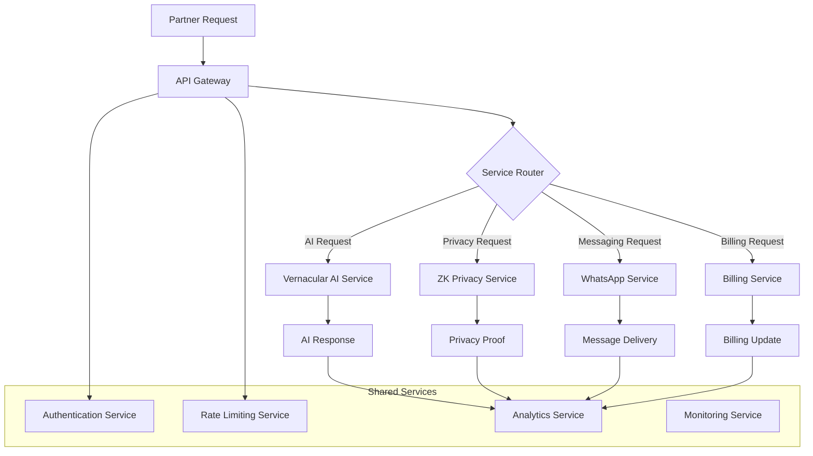

# TradeMate SaaS Service Extraction Plan
> **Carving Out SaaS Components for Fintech Ecosystem Partners**

## 🎯 **Overview**

Based on the comprehensive architecture analysis, TradeMate has a robust foundation of AI services, Zero-Knowledge privacy features, and WhatsApp integrations that can be packaged as SaaS offerings for banks, NBFCs, mutual funds, and insurance companies.

## 📦 **Core SaaS Components to Extract**

### **1. Vernacular AI Service Suite**

#### **Primary Service: Universal AI Engine**
```python
# Extract from: /app/ai_support/universal_engine.py
class TradeMateAIService:
    """
    Standalone vernacular AI service for fintech partners
    - 11 Indian languages with financial domain expertise
    - Tier-based service levels
    - Real-time conversation processing
    - Intent classification and response generation
    """
```

**Extractable Components:**
- **Language Processing Engine**: Multi-language NLP with financial terminology
- **Intent Classification**: Investment advice, portfolio queries, market analysis
- **Response Generation**: Contextual responses in vernacular languages
- **Conversation Management**: Multi-turn conversation state handling

**Partner Integration Points:**
- **REST API**: `/api/v1/ai/process` for text processing
- **WebSocket**: Real-time conversation streams
- **Webhook**: Event-driven response delivery
- **SDK**: Python, Java, Node.js client libraries

#### **Secondary Service: Voice Processing Engine**
```python
# Extract from: /app/ai/voice_processor.py
class VernacularVoiceService:
    """
    Voice processing service for Indian accent recognition
    - Audio transcription in 11 languages
    - Voice command processing
    - Text-to-speech in vernacular languages
    """
```

### **2. Zero-Knowledge Privacy Suite**

#### **Primary Service: ZK Proof Engine**
```python
# Extract from: /app/ai_support/zk_proof_engine.py
class TradeMatePrivacyService:
    """
    Zero-Knowledge privacy service for financial data protection
    - Portfolio analysis without data exposure
    - Risk assessment with cryptographic proofs
    - Multi-party computation for group analytics
    """
```

**Extractable Privacy Features:**
- **Anonymous Portfolio Analysis**: Prove portfolio metrics without revealing holdings
- **Private Risk Assessment**: Verify eligibility without exposing financial details
- **Confidential Benchmarking**: Peer comparison without identity exposure
- **Compliance Verification**: Prove regulatory compliance without data sharing

**Partner Integration:**
- **Privacy API**: `/api/v1/privacy/generate-proof` for ZK proof generation
- **Verification API**: `/api/v1/privacy/verify-proof` for proof validation
- **Analytics API**: Privacy-preserving group analytics
- **Compliance API**: Regulatory compliance verification

### **3. WhatsApp Messaging Infrastructure**

#### **Primary Service: WhatsApp Business Integration**
```python
# Extract from: /app/whatsapp/
class TradeMateMessagingService:
    """
    WhatsApp Business API integration for financial services
    - Multi-modal message processing
    - Interactive elements and rich media
    - Secure webhook handling
    """
```

**Extractable Messaging Components:**
- **Message Processing Pipeline**: Text, voice, image, document handling
- **Interactive UI Elements**: Buttons, lists, quick replies
- **Rich Media Support**: Charts, documents, voice messages
- **Secure Webhook Framework**: Signature verification and message routing

### **4. Billing & Subscription Management**

#### **Primary Service: Multi-Tier Billing System**
```python
# Extract from: /app/billing/unified_billing_system.py
class TradMateBillingService:
    """
    Intelligent billing system for financial services
    - Multi-tier subscription management
    - Payment processor integration
    - Revenue optimization and analytics
    """
```

**Extractable Billing Features:**
- **Subscription Management**: Tier-based service levels
- **Payment Processing**: UPI, cards, net banking integration
- **Revenue Analytics**: Real-time billing insights
- **Churn Prevention**: Intelligent retention mechanisms

## 🏗️ **SaaS Architecture Design**

### **Microservices Extraction Strategy**



### **API-First Design for Partners**

#### **1. Vernacular AI APIs**
```yaml
# AI Service API Specification
openapi: 3.0.0
info:
  title: TradeMate Vernacular AI API
  version: 1.0.0

paths:
  /ai/process:
    post:
      summary: Process vernacular text
      requestBody:
        content:
          application/json:
            schema:
              type: object
              properties:
                text:
                  type: string
                  example: "मेरे पोर्टफोलियो का प्रदर्शन कैसा है?"
                language:
                  type: string
                  enum: [hindi, bengali, telugu, tamil, etc.]
                user_context:
                  type: object
                  properties:
                    tier: string
                    preferences: object
      responses:
        200:
          description: AI response
          content:
            application/json:
              schema:
                type: object
                properties:
                  response:
                    type: string
                  intent:
                    type: string
                  confidence:
                    type: number
                  suggestions:
                    type: array
```

#### **2. Zero-Knowledge Privacy APIs**
```yaml
# Privacy Service API Specification
/privacy/generate-proof:
  post:
    summary: Generate ZK proof for portfolio analysis
    requestBody:
      content:
        application/json:
          schema:
            type: object
            properties:
              portfolio_data:
                type: string
                format: encrypted
              analysis_type:
                type: string
                enum: [performance, risk, compliance]
              privacy_level:
                type: string
                enum: [high, maximum, zero_knowledge]
    responses:
      200:
        description: ZK proof generated
        content:
          application/json:
            schema:
              type: object
              properties:
                proof:
                  type: string
                  format: base64
                public_outputs:
                  type: object
                verification_key:
                  type: string
```

#### **3. WhatsApp Messaging APIs**
```yaml
# Messaging Service API Specification
/messaging/send:
  post:
    summary: Send WhatsApp message
    requestBody:
      content:
        application/json:
          schema:
            type: object
            properties:
              to:
                type: string
                example: "+919876543210"
              message:
                type: object
                properties:
                  type:
                    type: string
                    enum: [text, interactive, media]
                  content:
                    type: object
              language:
                type: string
                example: "hindi"
    responses:
      200:
        description: Message sent successfully
```

## 💰 **SaaS Packaging & Pricing Strategy**

### **Service Tier Structure**

#### **Tier 1: Basic API Access**
```
Monthly Price: ₹25,000
Includes:
├── Vernacular AI: 10,000 requests/month
├── WhatsApp Integration: 5,000 messages/month
├── Basic Support: Email support
└── SLA: 99.5% uptime
```

#### **Tier 2: Professional Suite**
```
Monthly Price: ₹75,000
Includes:
├── Vernacular AI: 50,000 requests/month
├── WhatsApp Integration: 25,000 messages/month
├── ZK Privacy: 100 proofs/month
├── Professional Support: Phone + Email
└── SLA: 99.9% uptime
```

#### **Tier 3: Enterprise Platform**
```
Monthly Price: ₹2,50,000
Includes:
├── Unlimited API requests
├── Unlimited WhatsApp messages
├── Full ZK Privacy Suite
├── White-label customization
├── Dedicated support team
└── SLA: 99.99% uptime
```

### **Usage-Based Pricing Components**

#### **Pay-per-Use Options**
- **AI Processing**: ₹10 per 1,000 requests
- **ZK Proof Generation**: ₹100 per proof
- **WhatsApp Messages**: ₹2 per message
- **Voice Processing**: ₹5 per minute

#### **Volume Discounts**
- **High Volume (1M+ requests/month)**: 30% discount
- **Enterprise Volume (10M+ requests/month)**: 50% discount
- **Strategic Partners**: Custom pricing

## 🎯 **Target Partner Segments**

### **Segment 1: Large Banks & NBFCs**

#### **HDFC Bank Integration Example**
```python
# Partner-specific implementation
class HDFCBankIntegration:
    """
    Custom TradeMate integration for HDFC Bank
    - Vernacular customer service in Hindi/Marathi
    - ZK privacy for HNI customer portfolios
    - WhatsApp banking for mass market
    """
    
    async def process_customer_query(self, query, customer_tier):
        # Route to appropriate TradeMate service
        if customer_tier == "HNI":
            return await self.zk_privacy_service.process(query)
        else:
            return await self.vernacular_ai_service.process(query)
```

**Integration Points:**
- **Core Banking System**: API integration with existing CBS
- **Customer Database**: Secure customer data access
- **Mobile Banking App**: Embedded AI chat features
- **WhatsApp Business**: Direct messaging integration

#### **Bajaj Finance Use Case**
- **Hindi/Marathi AI**: Regional language loan processing
- **WhatsApp Automation**: Loan application and status updates
- **ZK Risk Assessment**: Private creditworthiness evaluation
- **Billing Integration**: Seamless payment collection

### **Segment 2: Fintech Startups**

#### **Groww Integration Example**
```python
class GrowwIntegration:
    """
    TradeMate services for Groww investment platform
    - Vernacular investment education
    - WhatsApp-based portfolio updates
    - Privacy-preserving performance analytics
    """
```

**Use Cases:**
- **Investment Education**: AI-powered learning in regional languages
- **Portfolio Notifications**: Real-time WhatsApp updates
- **Peer Benchmarking**: Anonymous performance comparison
- **Voice Trading**: Voice commands in Hindi/regional languages

#### **Zerodha Use Case**
- **Regional Language Support**: Trading platform in 11 languages
- **WhatsApp Alerts**: Price alerts and market updates
- **AI Trading Assistant**: Conversational trading support
- **Privacy Analytics**: Anonymous trading pattern analysis

### **Segment 3: Insurance Companies**

#### **LIC Integration Example**
```python
class LICIntegration:
    """
    TradeMate services for LIC insurance
    - Vernacular policy advisory
    - WhatsApp customer service
    - ZK privacy for health data
    """
```

**Integration Benefits:**
- **Vernacular Policy Advice**: Insurance guidance in regional languages
- **WhatsApp Claims**: Claim status and processing via messaging
- **Privacy Protection**: Health data privacy with ZK proofs
- **Customer Onboarding**: Simplified KYC in vernacular languages

## 🔧 **Technical Implementation Strategy**

### **Phase 1: Service Extraction (30 days)**

#### **Week 1: Code Modularization**
- Extract AI services from monolithic codebase
- Create standalone microservices
- Implement service interfaces and contracts
- Setup independent databases for each service

#### **Week 2: API Development**
- Design RESTful APIs for each service
- Implement authentication and authorization
- Add rate limiting and usage tracking
- Create comprehensive API documentation

#### **Week 3: SDK Development**
- Python SDK for AI and privacy services
- JavaScript SDK for web integration
- Java SDK for enterprise systems
- Sample code and integration examples

#### **Week 4: Testing & Validation**
- Unit tests for all extracted services
- Integration tests for API endpoints
- Performance testing under load
- Security testing and vulnerability assessment

### **Phase 2: Partner Portal Development (45 days)**

#### **Self-Service Partner Dashboard**
```python
class PartnerPortal:
    """
    Self-service portal for TradeMate SaaS partners
    - API key management
    - Usage analytics and billing
    - Service configuration
    - Support ticket management
    """
```

**Portal Features:**
- **Account Management**: Partner registration and profile
- **API Key Management**: Generate and rotate API keys
- **Usage Dashboard**: Real-time usage metrics and billing
- **Service Configuration**: Customize AI responses and privacy levels
- **Documentation**: Interactive API documentation and examples
- **Support**: Ticket system and knowledge base

#### **Billing & Analytics System**
- **Real-time Usage Tracking**: Monitor API calls and resource usage
- **Automated Billing**: Monthly invoicing based on usage
- **Analytics Dashboard**: Performance metrics and insights
- **Cost Optimization**: Recommendations for efficient usage

### **Phase 3: White-Label Customization (60 days)**

#### **Partner Branding Framework**
```python
class WhiteLabelFramework:
    """
    White-label customization for enterprise partners
    - Custom branding and themes
    - Partner-specific AI model training
    - Custom domain and SSL configuration
    """
```

**Customization Options:**
- **Brand Identity**: Logo, colors, fonts, messaging
- **Domain Configuration**: partner-domain.com/ai-service
- **AI Model Training**: Partner-specific financial terminology
- **Custom Workflows**: Partner-specific business logic
- **Compliance Settings**: Partner-specific regulatory requirements

## 📊 **Go-to-Market Strategy**

### **Phase 1: Pilot Partners (3 months)**

#### **Target: 5 Pilot Partners**
- 2 Large Banks (HDFC, ICICI)
- 2 Fintech Startups (Groww, Zerodha)
- 1 Insurance Company (LIC)

#### **Pilot Program Benefits**
- **Free 3-month trial**: Full access to all services
- **Dedicated Engineering Support**: Direct access to TradeMate team
- **Custom Integration**: Tailored implementation for pilot partners
- **Co-marketing Opportunities**: Joint case studies and press releases

### **Phase 2: Market Expansion (6 months)**

#### **Target: 25 Active Partners**
- 10 Regional Banks and NBFCs
- 10 Fintech Startups and Neo-banks
- 5 Insurance and Mutual Fund Companies

#### **Expansion Strategy**
- **Partner Referral Program**: Incentives for existing partners
- **Industry Events**: Fintech conferences and trade shows
- **Content Marketing**: Technical blogs and case studies
- **Sales Team**: Dedicated enterprise sales representatives

### **Phase 3: Platform Leadership (12 months)**

#### **Target: 100+ Partners**
- **Market Penetration**: 30% of Indian fintech companies
- **Revenue Target**: ₹100 Cr ARR
- **International Expansion**: Southeast Asia and Middle East
- **Platform Ecosystem**: Third-party developer marketplace

## 🏆 **Success Metrics & Monitoring**

### **Technical KPIs**
- **API Response Time**: <100ms average
- **System Uptime**: >99.9% across all services
- **Throughput**: 1M+ API requests/day
- **Error Rate**: <0.1% for all API endpoints

### **Business KPIs**
- **Partner Acquisition**: 5 new partners/month
- **Revenue Growth**: 20% month-over-month
- **API Usage**: 50% growth month-over-month
- **Customer Satisfaction**: >4.5/5 partner rating

### **Product KPIs**
- **Language Accuracy**: >95% for all 11 languages
- **ZK Proof Success Rate**: >99% proof generation
- **WhatsApp Delivery**: >98% message delivery rate
- **SDK Adoption**: 80% partners using SDKs

## 🎯 **Next Steps**

### **Immediate Actions (Next 7 days)**
1. **Create Service Extraction Branch**: `saas-service-extraction`
2. **Begin AI Service Modularization**: Extract universal AI engine
3. **Design API Specifications**: OpenAPI specs for all services
4. **Setup Partner Portal Framework**: Basic portal infrastructure
5. **Identify Pilot Partners**: Reach out to HDFC, Groww, LIC

### **30-Day Milestones**
- ✅ All services extracted and running independently
- ✅ Complete API documentation and SDKs
- ✅ Partner portal with basic functionality
- ✅ 2 pilot partners signed and onboarded
- ✅ Technical architecture validated

### **90-Day Goals**
- 📈 5 active pilot partners using TradeMate services
- 💰 ₹5 Cr ARR from SaaS services
- 🚀 Market validation and product-market fit
- 🔧 Production-ready platform with enterprise features
- 📊 Clear roadmap for Series A funding based on SaaS traction

**The TradeMate SaaS platform is ready to transform the Indian fintech ecosystem!** 🚀